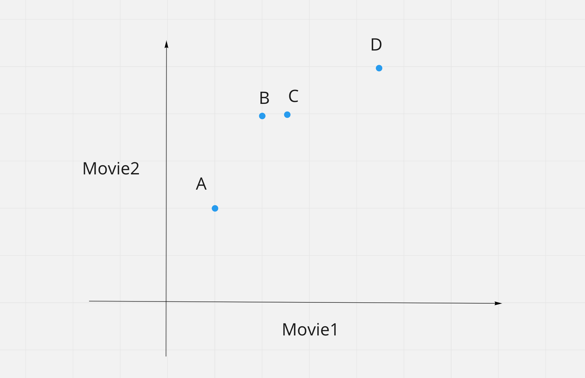
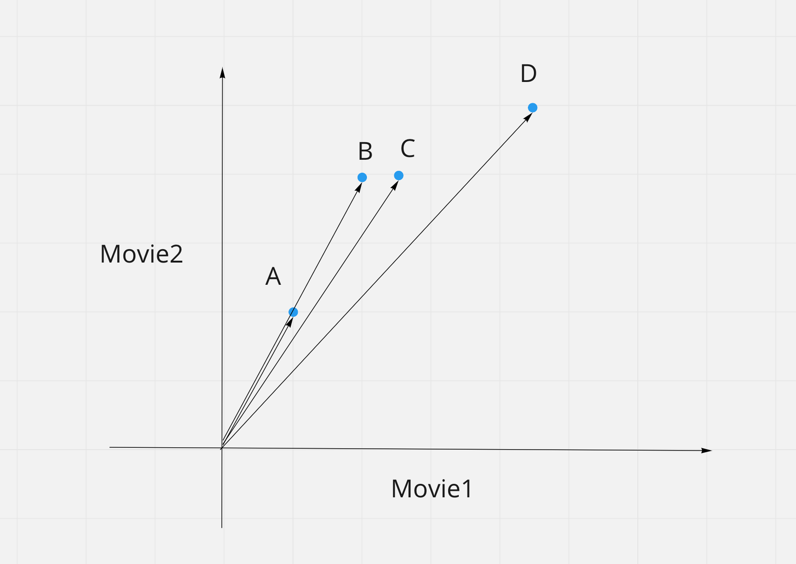
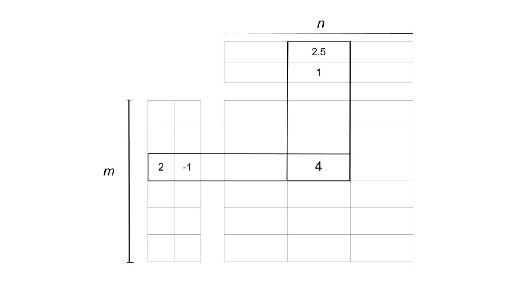

## 推荐系统看到此可以稍作休息(1)—基于协同过滤构建推荐引擎


> 为了分享此篇文章，个人做了大量的工作，所以未经本人同意，请勿转载，在此表示感谢

协作过滤是构建智能推荐系统时最常用的技术，随着收集到更多的用户信息，可以用这些数据学习出一个很好模型用于推荐。


### 无处不在推荐系统
最近消费者节日越来越多了，得益于物联网发展，网上购物已经成为主流，改变我们传统逛街的购物行为。说到电商少不了推荐系统。进入购物网站我们就被海量商品所包围，众多商品摆在我们面前给我们带来一个新的名称选择困难症。有实验证明种类多不如种类少的通常产品可以刺激我们消费购买。

今天我们都被海量的信息所包围，获取信息已经不再是问题，现代人一两天接受到信息量大约等同于中世纪人一生所接触到信息量。问题是如何在海量的信息中，找到我们想要的信息。所以今天推荐系统不再是锦上添花，而是必不可少。
那么什么是推荐系统，推荐系统做了那些工作呢？其实推荐系统就是根据用户的历史信息和行为，向用户推荐他感兴趣的内容或商品。

大多数网站，如亚马逊、YouTube 和 Netflix，都使用**协同过滤**作为其复杂的推荐系统的一部分。你可以使用这种技术来建立推荐引擎，根据类似用户的共同爱好来向用户推荐商品。

#### 将要学到那些内容

### 什么是协同过滤
协同过滤是一种技术，可以根据类似用户的行为来过滤出用户可能喜欢的项目。协同过滤分析用户兴趣，在用户群中找到指定用户的相似(兴趣)用户，综合这些相似用户对某一信息的评价，形成系统对该指定用户对此信息的喜好程度预测。

### 数据集

要探究这个推荐算法，准备一个小例子，数据是一组项目和一组用户，用户对项目有评价作为要分析的数据。

用户对商品的评估(感觉)可以是显式的(例如在 1 到 5 级的评分，喜欢或不喜欢）也可以是隐式的(查看一个项目，将其添加到购物车上，是否愿意在内容花费时间等）。

在处理这类数据时，矩阵的形式出现用户对项目的评估。行表示用户列表示项目，用户和项目交叉位置为用户对该商品的评分。


| User/itme | Item1 | Item2 | Item3 | Item4 | Item5 |
| --------- | ----- | ----- | ----- | ----- | ----- |
| User1     | 5     |       |    4   |     1  |       |
| User2     |       | 3 |       | 3 |       |
| User3     |       | 2 | 4 | 4 | 1 |
| User4     | 4 | 4 | 5 |       |       |
| User5     | 2 | 4 |       | 5 | 2 |


上面为用户和项目的评分矩阵，例如，user1 给 Item3 的评分 4 分。

在大多数情况下，矩阵中的位置是空的，因为用户只对几个项目进行了评分。每个用户对所有项目进行评分显然是不现实的。这样大部分位置为空的矩阵通常被称为**稀疏矩阵**，而与此相反(大部分位置都有值的矩阵)被称为**密集矩阵**。

有很多数据集被收集起来并提供给公众用于研究和基准测试。这里有一个高质量的数据源清单，你可以从中选择。

接下来分析会用到的是 GroupLens Research 收集的 MovieLens 数据集。MovieLens 包含了 100k 数据集是一个稳定的基准数据集，有 943个用户对 1682 部电影给出的 10 万个评分，每个用户至少有 20 部电影的评分。

这个数据集由多个文件组成，包含了关于电影、用户和用户对他们所看的电影的评分的信息。其中值得关注的有以下几个。


### 协同过滤一般的步骤

如何根据用户行为来构建一个推荐系统，大致分为两个步骤第一步是寻找类似的用户或物品。第二步是推算出尚未被用户评估的项目，用户对该项目可能给出评分，要实现这些就需要回答一些问题

- 如何度量用户间或者项目间的类似性
- 已经找出和用户相似的用户，如何根据相似用户的评分来推测该用户会给一个项目的评分
- 如何衡量模型推测用户给某一个项目评分的准确性

前两个问题的答案并不唯一。协同过滤是一个算法家族，有多种算法可以用于计算用户或者商品间的类似性，也有多种算法可以根据类似用户的评分来计算该用户对项目的评分。根据你的选择，你最终会得到一种协作过滤的方法。

有关协同过滤，这里需要注意的是，在一个纯粹基于协作过滤的算法中，计算用户相似度不会使用如用户的年龄、电影的类型或任何其他关于用户或项目的特征数据。而只根据用户对一个项目的评分(明确或隐含)来计算用户或商品间相似性。例如，如果两个用户对十部电影给予同样的评价，尽管他们的年龄有很大的差别，也可以认为是相似的。

##### 皮尔逊相关系数

$$
sim(a,b) = \frac{\sum_{i \in I}(r_{a,i} - \overline{r}_a)(r_{b,i} - \overline{r}_b)}{ \sqrt{\sum_{i \in I}(r_{a,i}- \overline{r}_a)^2}\sqrt{\sum_{i \in I}(r_{b,i}- \overline{r}_b)^2}}
$$

- $I$ 表示用户 a 和 用户 b 共同感兴趣的项目
- $r_{a,i}$ 表示用户 a 对 i 项目的评分，$r_{a,i}$ 表示用户 a 对 i 项目的评分
- $\overline{r}_a$ 表示对 a 项目平均评分

##### 余弦相似度

$$
sim(a,b) = \frac{r_a,r_b}{||r_a|||r_b||}
$$

第三个问题为如何衡量模型(算法)预测的准确性，也有多个答案，其中包括误差计算技术，可以用在很多地方，而不仅仅是限于协同过滤的推荐器。

衡量你的结果的准确性的方法之一是均方根误差(RMSE)，在这个方法中，预测用户-项目对的测试数据集的评分，这些数据集的评分值已经是已知的。已知值和预测值之间的差将是误差。将测试集的所有误差值平方，找到平均数(或平均值)，然后取该平均值的平方根，得到RMSE。

另一个衡量准确度的指标是平均绝对误差(MAE)，通过找到误差的绝对值，然后取所有误差值的平均值来计算误差的大小。

在这一点上，不需要担心 RMSE 或 MAE的细节，以及如何实现，因为大多数 Python 包中都提供现成方法供你调用。

现在让我们来看看协同过滤家族中的不同类型的算法。

### 基于记忆的协同过滤
所谓基于记忆的算法，就是使用统计技术来对整个数据集进行统计从而预测用户对项目的评分。

为了找到一个用户 U 会给一个项目 I 的评分 R，该方法包括。

- 找到与 U 相似的并对项目 I 进行过评分的用户
- 基于找到的相似用户的评分来计算评分 R

你会在下面的章节中看到每一个细节。

#### 如何基于评估矩阵找到相似的用户
为了理解相似性的概念，让我们先创建一个简单的数据集来说明相似性。该数据包括四个用户 A、B、C 和 D，他们对两部电影进行了评分。评分被存储在列表中，每个列表包含两个数字，表示每部电影的评分。

A 的评分是 [1.0, 2.0]。
B 的评分是 [2.0, 4.0]。
C 的评分是 [2.5, 4.0]。
D 的评分是 [4.5, 5.0]。

为了便于观察，我们把这些点绘制到图上




在上图中，每个点代表一个用户，并与他们给两部电影的评分相比较。

观察这些点之间的距离似乎是估计相似性的一个好方法，对吗？你可以用两点之间的欧几里得距离公式来计算距离。你可以使用scipy中的函数，如下面的程序所示。


如上所示，可以使用 `scipy.spatial.distance.euclidean`来计算两点之间的距离。用距离来表示 A、B、D的评分与C的评分之间的距离，就距离而言，C 的评分与 B 的评分最接近。

通过看图也不难发现距离用户 C 最接近用户是 B 。如果范围缩小在 A 和 D 中，C 和谁更接近呢？


如果抛开实际仅从距离上来看，D 相对于相对 A 要更接近 C ，也就是 D 距离 C 更近，看是看一下 A 和 C 对两部电影评分，不难发现他们之间是成比例的，都是给第二部电影 2 倍于第一部电影评分，说明他们都是喜欢第二部电影，从实际出发应该 A 和 C 更相似。


通过上面解释，欧氏距离无法正确通过评分来反应用户间相似性，所以我们来看一些连接各点与原点的线(向量)之间的角度可以用于衡量他们之间相似性。




现在我们用向量来表示四个用户，其中 A 和 B 的线是重合的，所以之间的角度为0 。也就是说两个向量的相似性是与他们之间夹角是成反比的。

为了用角度计算相似度，需要这样一个函数，当两个向量间的角度越小，则返回较高的相似度，可以说他们距离越小，两个向量之间夹角角度较大，则返回越小的相似度。角度的余弦是一个函数，随着角度从 0 到 180 的增加，余弦从1 减到 -1。

你可以用角度的余弦来寻找两个用户之间的相似度。角度越大，余弦就越小，用户的相似度就越低。也可以将角度的余弦值反过来，就是用 1 减去用户之间的余弦距离。

scipy 有一个函数可以计算向量的余弦距离。角度越大，这函数返回的值越高。


C 和 A 的向量之间的角度越小，余弦距离值就越小。想以这种方式对用户的相似性进行排序，请使用余弦距离。


> 注意：在上面的例子中，只考虑了两部电影，这使得评评分向量在两个维度上更容易可视化。这样做更加直观便于解释。对于多个项目，评分向量维度就更多。可能还想研究一下余弦相似性的数学原理。


这里尽管用户 A 和 B 的对两部电影评分不同，但是他们的余弦相似度却很小。这是为什么我们不难发现他们评分是成一定比例的，为什么会有这样效果，这里 A 用户可能是比较苛刻，很难出给高分的用，而 B 用户是一个老好人，通常他给出评分都会很高。也就是他们之间都有一个评分起步值，要消除他们的起步值不同，我们放到同一个水平或者方式来衡量两个用户对项目喜好程度。这是为什么我们采用来衡量用户的相似性。


对于用户A来说，评分向量 [1, 2] 的平均值为1.5。从每个评分中减去 1.5，就可以得到向量[-0.5, 0.5]。
对于用户B来说，评分向量 [2, 4] 的平均值为 3。从每个评分中减去 3，就会得到一个向量[-1, 1]。


试着对用户C 和 D 做同样的操作，就会发现，现在所有的用户的评分都被调整为平均 0，这使他们都处于同一水平，并消除了他们的偏见。

The cosine of the angle between the adjusted vectors is called **centered cosine**. This approach is normally used when there are a lot of missing values in the vectors, and you need to place a common value to fill up the missing values.

调整后的向量之间的角度的余弦被称为**中心余弦**。这种方法通常用于向量中存在大量缺失值的情况，需要放置一个共同的值来填补缺失的值。


用一个随机值来填补评级矩阵中的缺失值可能导致不准确。填补缺失值的一个好的选择可能是每个用户的平均评分，但用户 A 和 B 的原始平均数分别是 1.5 和 3，用 1.5 填补 A 的所有空值，用 3 填补 B 的所有空值，可能导致他们不再是相似的用户。


但在调整数值后，两个用户的中心平均数都是 0，这样就可以更准确地捕捉到两个用户的项目高于或低于平均数的想法，两个用户向量中的所有缺失值都是 0。


欧氏距离和余弦相似度是一些可以用来衡量用户间的相似度的方法，甚至是彼此相似的项目的方法。(上面使用的函数计算余弦距离。要计算余弦相似度，从1中减去距离）。)


> 注意：居中余弦的公式与皮尔逊相关系数的公式相同。你会发现，许多关于推荐人的资源和图书馆将居中余弦的实现称为皮尔逊相关。

#### 如何计算评分

在你确定了一个与用户 U 相似的用户名单后，需要计算 U 对某一物品I的评分 R。同样，就像相似性一样，可以用多种方式来做这件事。

你可以预测，一个用户对某一物品I的评分R将接近与U最相似的前5名或前10名用户对I的评分的平均值。


$$
R_U = \frac{\sum_{u=1}^n R_u}{n}
$$


这个公式表明，对 n 个相似用户求其对项目评分均值作为用户对项目 I 的评分。可以从对相似用户进行一个排序，然后选择前 n 用户对项目 I 评分的均值做为用户 U 的对 I 项目评分，当然考虑最相似用户对项目评分对于预估目标用户给项目的评分应该贡献越大。


在加权平均法中，你将每个评分乘以一个相似度系数。通过与相似度系数相乘，为评分添加了权重。相似用户权重(相似度)越大，评分就越重要。


作为权重的相似度系数，应该是上面讨论的距离的倒数，因为距离越小意味着相似度越高。例如，可以用 1 减去余弦距离，得到余弦相似度。有了每个与目标用户 U 相似的用户的相似度系数 S，可以用这个公式计算加权平均数。


$$
R_u = \frac{\sum_{u=1}^n R_u S_u}{\sum_{u=1}^n S_u}
$$
在上述公式中，每个相似用户给出评分都要乘以给出该评分的用户的相似度系数。用户 U 的最终预测评分将等于加权的评分之和除以权重之和，也就是正则化一下。


> 注意：如果你想知道为什么加权评分求和是除以权重之和，而不是除以 n，请考虑一下，在前面的平均数公式中，除以 n，因为那是每一个相似用户权重都是权重的值是 1。


用加权平均法，你会更多地考虑类似用户的评分，按其相似度排序。


现在，你知道如何找到类似的用户，以及如何根据他们的评分来计算目标用户对项目的评分。还有一种协同过滤的变体，通过寻找彼此相似的项目而不是用户来预测评分，并计算出评分。将在下一节中了解这种变体。


#### 基于用户的协同过滤与基于项目的协同过滤


上面解释的例子中的技术，即用评分矩阵根据用户给出的评分搜索与其类似的用户，称为**基于用户(users base)**或用户-用户协同过滤。如果用评分矩阵根据用户给出的评分来寻找类似的项目，那么这种方法称为**基于项目(item-bases)**或项目-项目协同过滤。

这两种方法在数学和流程上很相似，但两者在概念上有区别。以下是这两种方法的比较。


##### 基于用户(user-based)

对于一个用户 U 来说，根据用户对项目评分来计算出一个与 U 用户相似的用户列表，并根据相似性对相似用户进行排序。通过与 U 用户相似用户对 U 用户没有见过的而给出评分来预估该用户可能给该项目的评分

##### 基于项目(Item-based)

对于一个项目 I，根据用户对项目评分选择出 I 项目的相似的项目列表，从相似列表中挑选出 N 个已被 U 用户评分的项目，并根据这 N个评分计算出用户 U 的可能对这个他从没有见过的项目的评分。


**基于项目的协同过滤**是由亚马逊开发的。在一个用户远远多于项目的系统中，基于项目的过滤比基于用户的过滤更快、更稳定。
之所以基于项目有效，是因为通常情况下，一个项目收到的平均评分不会像用户给不同项目的平均评分那样快速变化。众所周知，当评分矩阵稀疏时，也比基于用户的方法表现更好。

但是**基于项目**的方法在有浏览或娱乐相关项目的数据集上表现不佳，比如MovieLens，给出的推荐对目标用户来说似乎非常明显。这样的数据集使用矩阵分解技术会有更好的效果，

##### 推荐多样性和精度

- 基于物品的推荐—有限推荐列表中可能包含了一定数量不热门的长尾物品
- 基于用户的推荐—多样性
- 以项目为基础的协同过滤不用考虑用户间的差别，所以精度比较差,但是却不需要用户的历史数据，或是进行用户识别。对于项目来讲，它们之间的相似性要稳定很多，因此可以离线完成工作量最大的相似性计算步骤，从而降低了在线计算量，提高推荐效率，尤其是在用户多于项目的情形下尤为显著。


### 基于模型的协同过滤(Model Based)

基于模型的方法涉及到一个减少或压缩大而稀疏的用户项目矩阵。为了理解这个步骤，对降维的基本理解会很有帮助。

#### 降维
在用户-项目矩阵中，有两个维度。

- 用户的数量
- 项目的数量

如果矩阵大部分是空的，减少维度可以在空间和时间上提高算法的性能。可以使用各种方法，如矩阵因子化或自动编码器来做到这一点。

**矩阵因式分**解可以看作是将一个大矩阵分解两个小矩阵的乘积。这类似于整数的因式分解，12 可以写成 6×2 或 4×3。在矩阵的情况下，一个维度为 m×n 的矩阵 A 可以被简化为两个尺寸分别为 m×p和 p×n 的矩阵 X 和 Y 的乘积。

> 值得注意，在矩阵乘法中，只有当 X 的列数与 Y 的行数相等时，矩阵 X 才能与 Y 相乘，因此两个被降低的矩阵有一个共同的维数 p。而且通常 p 维度要远远小于 m 或者 n

分解后得到用户矩阵和项目矩阵，用户矩阵中的 m 行代表第 m 个用户，p 表示用户的特征。项目矩阵也是如此，有 n 个项目每一个项目也有 p 个特征。下面是一个关于矩阵分解的例子。




在上面的图片中，矩阵分解为两个矩阵。左边的是有 m 个用户的用户矩阵，上面的是有 n 个项目的项目矩阵。评分 4 通过两个矩阵 m 向量和 n 项目的特征向量点积的结果

- 一个用户向量(2, -1)

- 一个项目向量(2.5, 1)

可以这样理解我们找到 p 特征向量通过，用户和项目通过矩阵分解他们可以用 p 维特征向量来表示，也就是我们将不同事物通过他们之间潜在关系引入到一个空间。因子矩阵可以提供关于用户和项目的这种洞察力，在这个例子中，你有两个关于电影类型的潜在因素，但在实际场景中，这些潜在因素不会被意识到，而且也难于解释，这也是矩阵分解一个弊端。潜伏因素的数量会影响推荐，因素的数量越多，推荐就越个性化。但是，过多的因素会导致模型的过度拟合。


####  矩阵分解算法(Matrix Factorization)

对矩阵进行因式分解的流行算法之一是奇异值分解（SVD）算法。当矩阵因式分解在 Netflix 奖竞赛中表现良好时，SVD 进入了人们的视野。其他算法包括 PCA 及其变化，NMF 等。如果你想使用神经网络，自动编码器也可用于降维。

### 使用 Python 构建推荐引擎

在 Python 中，有相当多的库和工具包提供了各种算法的实现，可以用封装好的方法轻松地来构建一个推荐引擎。可以尝试的是Surprise。Surprise 是一个 Python SciKit，提供有各种推荐算法和相似度量，利用这些算法可以实现推荐系统。


下面是如何使用 `pip`来安装所需的依赖包。
```python
pip install numpy
pip install scikit-surprise
```

要使用 Surprise，首先需要了解 Surprise 提供一些基本模块和类。

数据集模块用于从文件、Pandas dataframes，也提供可用于测试和学习的内置数据集。(MovieLens 100k 是Surprise中的一个内置数据集)为了加载一个数据集，一些可用的方法是。

```python
Dataset.load_builtin()
Dataset.load_from_file()
Dataset.load_from_df()
```

`reander` 的类是用来解析包含评分的文件的。下面介绍如何配置 reader 来读取数据集

- `line_format` 是一个字符串，用来存储数据的顺序，字段名用空格分隔，如 "item user rating"。
- `sep` 用来指定字符串间的分隔符，比如','
- `rating_scale` 用于指定评分等级。默认是(1，5)
- `skip_lines` 用来表示在文件开始时要跳过的行数。默认值是 0。

创建一个 `load_data.py` 文件，可以用来从 Pandas DataFrame或从内置的 MovieLens 100k 数据集中加载数据。

```python
# load_data.py

import pandas as pd
from surprise import Dataset
from surprise import Reader

# This is the same data that was plotted for similarity earlier
# with one new user "E" who has rated only movie 1
ratings_dict = {
    "item": [1, 2, 1, 2, 1, 2, 1, 2, 1],
    "user": ['A', 'A', 'B', 'B', 'C', 'C', 'D', 'D', 'E'],
    "rating": [1, 2, 2, 4, 2.5, 4, 4.5, 5, 3],
}

df = pd.DataFrame(ratings_dict)
reader = Reader(rating_scale=(1, 5))


# 加载 Pandas dataframe
data = Dataset.load_from_df(df[["user", "item", "rating"]], reader)
# 加载内置 Movielens-100k 数据集
movielens = Dataset.load_builtin('ml-100k')
```

#### 基于 K 近邻(k-NN)的算法
推荐功能的算法选择取决于你要使用的技术。对于上面讨论的基于记忆的方法，适合的算法是 Centered k-NN，因为该算法非常接近上面解释的Centered cosine 相似度公式。在 Surprise 中提供了 KNNWithMeans 的实现。调用这个方法 `KNNWithMeans` 我们需要传入一个配置项，配置型以字典形式自定义一个 KNNWithMeans。有关参数含义在下面给出解释。

- name 包含要使用的相似度量。选项有 cosine、msd、pearson或pearson_baseline。默认是 MSD 
- user_based 是一个布尔值，告诉人们该方法是基于用户还是基于项目。默认值为 True，这意味着将使用基于用户的方法
- min_support 是用户之间考虑相似性所需的最小共同项目数。对于基于项目的方法，这对应于两个项目的最小共同用户数

```python
# recommender.py

from surprise import KNNWithMeans

# To use item-based cosine similarity
sim_options = {
    "name": "cosine",
    "user_based": False,  # Compute  similarities between items
}
algo = KNNWithMeans(sim_options=sim_options)
```

上述程序中的推荐功能被配置为使用余弦相似度，并使用基于项目的方法来寻找类似的项目。

为了测试这个推荐引擎，需要从数据集获取 Trainset。可以使用整个数据集作为训练数据集，也可以部分数据来创建训练数据集。通常我们会把数据集拆分为训练数据集和测试数据集。


```python
from load_data import data
from recommender import algo

trainingSet = data.build_full_trainset()

algo.fit(trainingSet)
Computing the cosine similarity matrix...
Done computing similarity matrix.
<surprise.prediction_algorithms.knns.KNNWithMeans object at 0x7f04fec56898>

prediction = algo.predict('E', 2)
prediction.est
4.15
```

该算法预测用户 E 会给这部电影 2 给出 4.15 分，这个分数表明已经满足一个操作系统引擎基本要求，虽然简单，都是对于实际项目往往简单更有效，简单便于管理控制和排除问题。

你应该尝试一下不同的基于k-NN的算法以及Surprise库中不同的相似度选项和矩阵分解算法。可以在 MovieLens数据集上尝试算法，通过对比结果哪一个算法和哪一个套参数更有效。

#### 调整算法参数
Surprise 提供了一个 GridSearchCV 类，类似于 scikit-learn 的 GridSearchCV，也就是将搜索最优参数交给框架自动完成，我们只需要给出算法的出现超参数的取值范围或者选项，告诉其以用于衡量模型好坏的一个参数即可。

```
from surprise import KNNWithMeans
from surprise import Dataset
from surprise.model_selection import GridSearchCV

data = Dataset.load_builtin("ml-100k")
sim_options = {
    "name": ["msd", "cosine"],
    "min_support": [3, 4, 5],
    "user_based": [False, True],
}

param_grid = {"sim_options": sim_options}

gs = GridSearchCV(KNNWithMeans, param_grid, measures=["rmse", "mae"], cv=3)
gs.fit(data)

print(gs.best_score["rmse"])
print(gs.best_params["rmse"])
```

```

```

```
0.9725497699737625
{'sim_options': {'name': 'msd', 'min_support': 3, 'user_based': True}}
```

